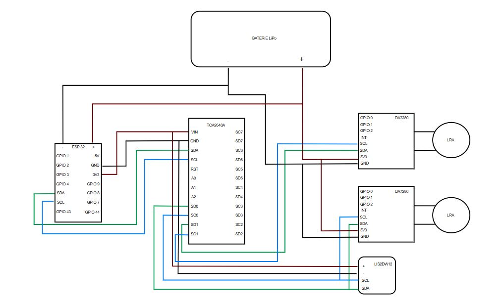

# BlindDance
a rythm game for blind people to play with.

# Table of Contents
1. [Introduction](#Introduction)
2. [How to play](#How-to-play)
3. [mitain/CAO](#mitain/CAO)
4. [Electronic Circuits](#Electronic-Circuits)
5. [Game Interface](#Game-Interface)
6. [Issue and futur improvement](#Issue-and-futur-improvement)

## Introduction
## How to play
here is a step by step guide on how to play :
- create a hotspot on your computer --> go on your parameter and search hotspot, then you need to adapt the esp32 code with the name of your hotspot and your password, you will see the device connected on your hotspot and their ip adress (see [Electronic Circuits] )
- wear the mitain, box upside, then power on the device, push the switch toward the back of the box.
- enter the ip adress on the game file wifi_esp32.py, jeu.py and test_vibration.py (see [Game Interface])
- launch the game (main.py) it will start to link withe the two devices, you should feel a vibration.
- use the number on your keyboard to navigate on the menu to start a game.
## mitain/CAO

## Electronics

### Used Components

#### XIAO ESP32S3 + and XIAO ESP32C6

**Datasheets:**
- [Getting Started with Seeed Studio XIAO ESP32S3 Series](https://wiki.seeedstudio.com/xiao_esp32s3_getting_started/)
- [Getting Started with Seeed Studio XIAO ESP32C6](https://wiki.seeedstudio.com/xiao_esp32c6_getting_started/)

**Role:**
- Management of WiFi communication with the PC  
- Reception of vibration commands  
- Reading of motion data (accelerometer)  
- Coordination between all I2C components (haptic driver, accelerometer)  
- Each ESP32 is connected to the PC WiFi hotspot  

---

#### TCA9548A Multiplexer

**Datasheet:**
- [Low Voltage 8-Channel I2C Switch With Reset](https://cdn-shop.adafruit.com/datasheets/tca9548a.pdf)

Two haptic drivers use the same I2C address.  
A multiplexer is therefore required to differentiate them and avoid I2C bus conflicts.

---

#### Haptic Driver – DA7280

**Datasheet:**
- [Haptic Driver DA7280](https://cdn.sparkfun.com/assets/a/e/d/1/9/da7280_datasheet_3v0.pdf)

**Library used:**
- [GitHub – PatternAgents / Haptic_DA7280](https://github.com/PatternAgents/Haptic_DA7280/tree/master)

**Role:**
- Generates and precisely controls vibrations  
- Drives LRA motors  
- Allows definition of waveforms, durations, and intensities  
- Better haptic control than PWM  

---

#### LRA

**Datasheet:**
- [LRA HD-VA3222](https://api.puiaudio.com/filename/HD-VA3222.pdf)

**Role:**
- Produces vibration  
- Non-polarized motor  
- Requires current peaks managed by the DA7280 driver  

---

#### Accelerometer

**Datasheet:**
- [Gravity: I2C LIS2DW12 Accelerometer](https://wiki.dfrobot.com/Gravity_I2C_LIS2DW12_Triple_Axis_Accelerometer_SKU_SEN0409)

**Library used (recommended by the datasheet):**
- [GitHub DFRobot / DFRobot_LIS](https://github.com/DFRobot/DFRobot_LIS)

**Role:**
- Motion detection  
- Sends an event when the bracelet moves  
- Parameters configured on the ESP32

### Global Electronic Architecture

*Figure 1 – Global electronic architecture of one bracelet*

## Game Interface
## Issue and futur improvement

